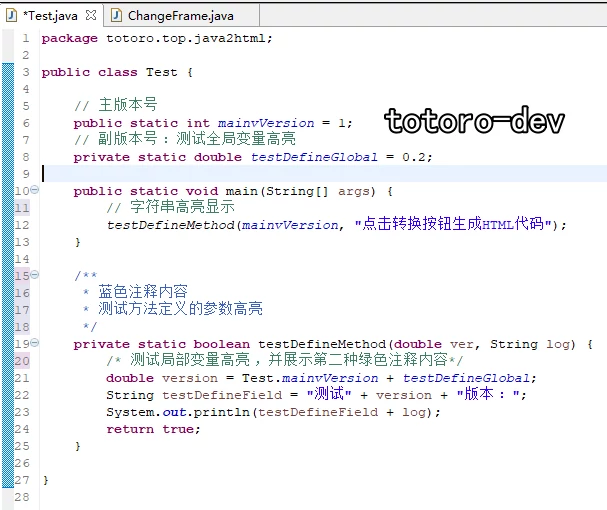
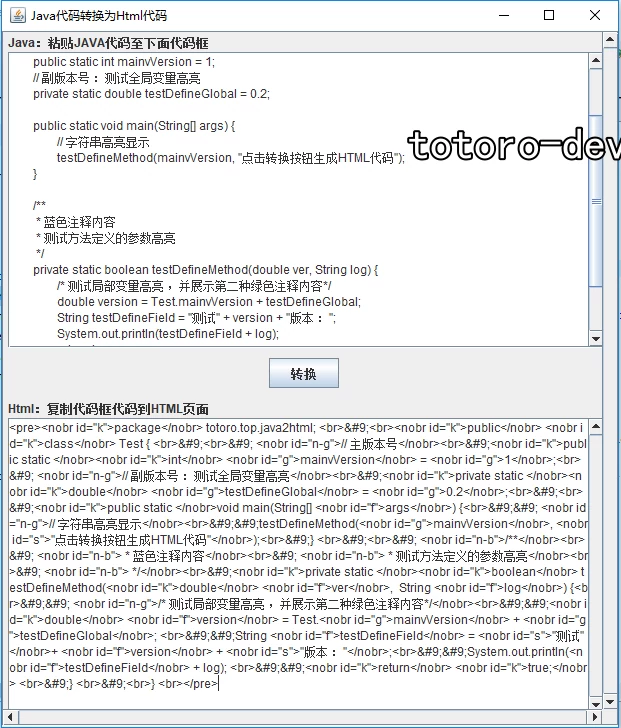
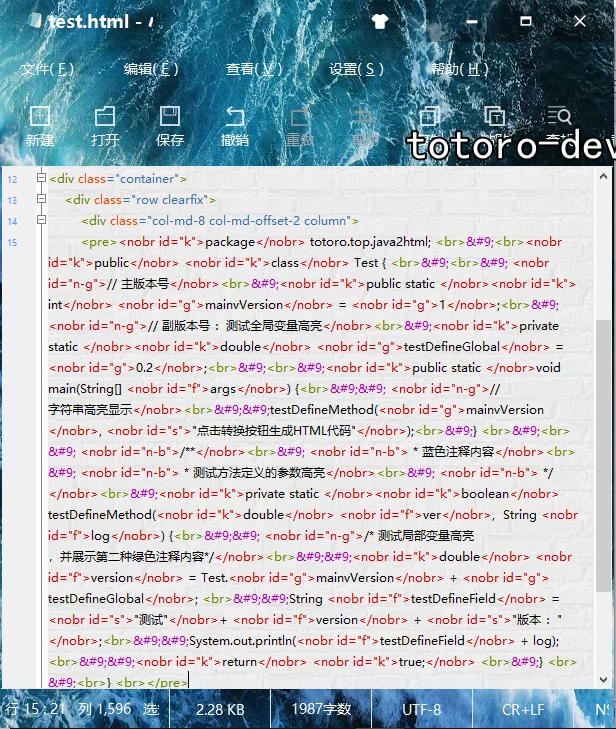
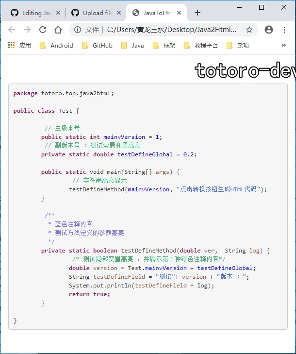

# Java2Html 
能将格式化的Java代码转换成Html高亮显示模板的代码转换器。 

## 代码转换器1.2版本更新 
### 1. JavaToHtml-1.2可运行程序 
### &emsp;<a href="https://github.com/totoro-dev/Java2Html/releases/download/1.2/JavaToHtml-1.2.jar">点击下载</a> 
### 2. 新增功能 
2.1 界面支持自适应布局； 
2.2 支持全局变量、局部变量高亮； 
2.3 支持构造器、方法定义的参数高亮； 
2.4 支持字符串高亮； 
2.5 优化注释高亮：在两个绿色注释内容基础上，添加蓝色注释内容； 
2.6 大量优化代码转换的细节，转换后的HTML代码模板更贴近Java代码高亮。 

## 代码转换器1.2版本使用 
### 1. 代码编辑器中编写Java代码 
 
### 2. 使用转换器生成Html模板代码 
 
### 3. Html编辑器中粘贴生成的模板代码 
 

### 4. 引入changer.css样式表 
#### 4.1 <a href="https://github.com/totoro-dev/Java2Html/releases/download/1.2/changer.css">下载changer.css</a> 
#### 4.2 在header节点中使用link标签引入样式表 
`<link rel="stylesheet" href="css的url">` 
#### 4.3 自定义样式表 
4.3.1 直接修改<a href="https://github.com/totoro-dev/Java2Html/blob/master/css/changer.css">changer.css</a>文件 
4.3.2 样式表的标签id名不能更改。 
4.3.3 将标签的颜色改成自己想要的样式即可。 

### 5. 浏览器查看Java代码高亮效果 
 

## Java代码编码规范 
### 1. 编码规范阅读&emsp;<a href="编码规范.txt">阅读规范</a> 
### 2. 编码规范下载&emsp;<a href="https://github.com/totoro-dev/Java2Html/releases/download/1.2/CodingSpecification.txt">下载阅读</a> 

## HTML代码高亮测试实例 
<a href="https://github.com/totoro-dev/Java2Html/releases/download/1.2/test.zip">下载测试实例</a> 
解压后直接用浏览器打开test.html即可查看效果
