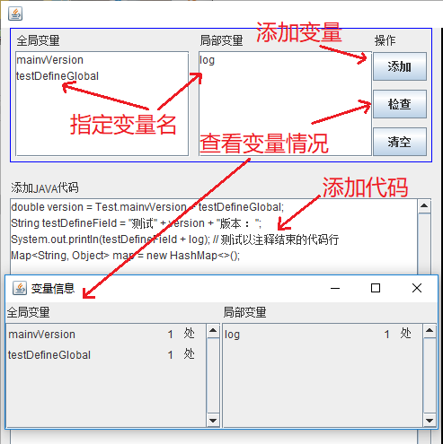
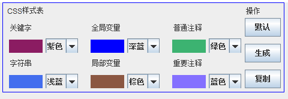
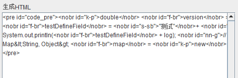
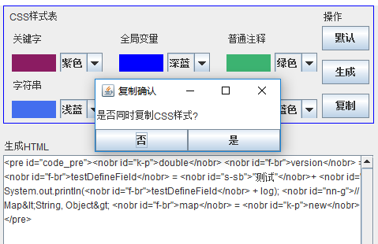
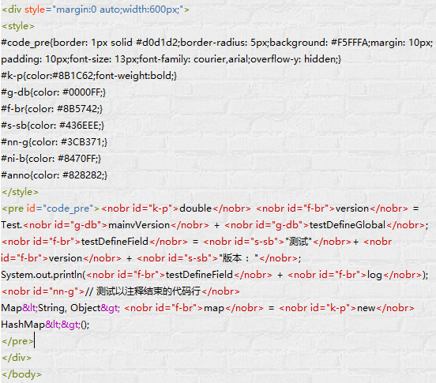
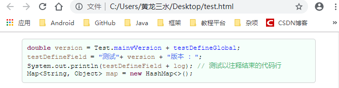

# Java2Html 
能将格式化的Java代码转换成Html高亮显示模板的代码转换器。 

## 代码转换器1.3.1版本更新 
### 1. JavaToHtml-1.3.1可运行程序 
### &emsp;<a href="https://github.com/totoro-dev/Java2Html/releases/download/1.3.1/JavaToHtml-1.3.1.jar">点击下载</a> 
### 2. 新增功能 
2.1 支持手动添加全局和局部变量（当定义变量的代码不在转化的源码中时）。 
2.2 支持动态改变高亮样式表（之前版本需要自主修改样式表文件changer.css），现在样式表可被选择性地嵌入到生成的代码中。既可以只复制html代码，也可以同时复制css和html代码（必须保证已经获取过指定css样式代码）。 
2.3 支持对所有可识别地变量全文检查出现次数。 
2.4 支持对泛型的检查，减少尖括号对html代码的影响。 
### 3. 下次更新预告 
3.1 支持Java代码框自主控制缩进。 
3.2 支持一键默认浏览器预览高亮效果。 
3.3 支持注解含参情况的高亮。 
3.4 全面解决尖括号bug。 

## 代码转换器1.3.1版本使用 
### 1. 在代码框添加代码，选择性添加代码片段中不包含定义的变量，点击检查按钮查看变量情况。 
 
### 2. 根据需要，选择性修改高亮样式表 
 
### 3. 点击生成按钮，生成高亮html代码 
 
### 4. 点击复制按钮，对话框选择是否同时复制css样式表（如果之前未复制过修改的样式表则选择“是”） 
 
### 5. html编辑器中粘贴代码 
 
### 6. 浏览器查看Java代码高亮效果 
 

## Java代码编码规范 
### 1. 编码规范阅读&emsp;<a href="编码规范.txt">阅读规范</a> 
### 2. 编码规范下载&emsp;<a href="https://github.com/totoro-dev/Java2Html/releases/download/1.2/CodingSpecification.txt">下载阅读</a> 

## HTML代码高亮测试实例 
<a href="https://github.com/totoro-dev/Java2Html/releases/download/1.3.1/test.html">下载测试实例</a> 
下载后直接用浏览器打开test.html即可查看效果
